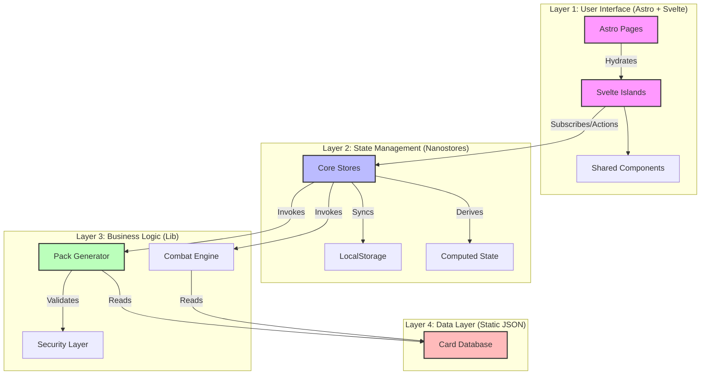
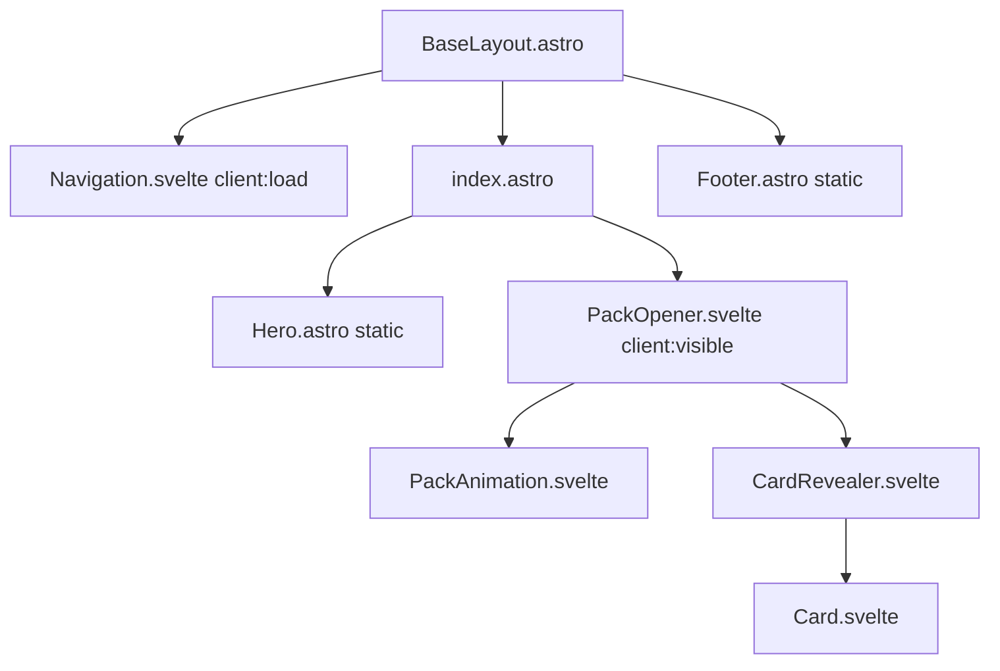
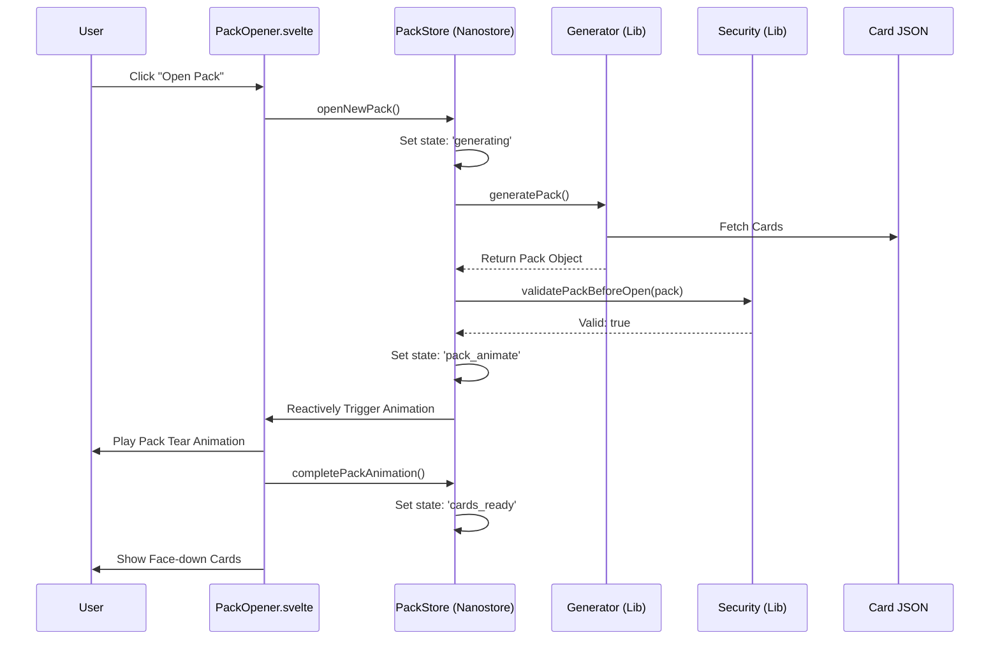
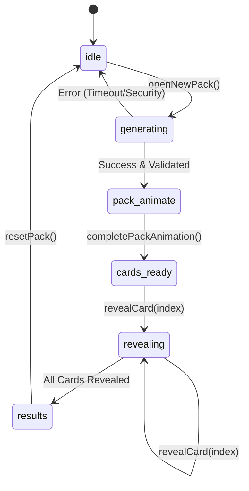
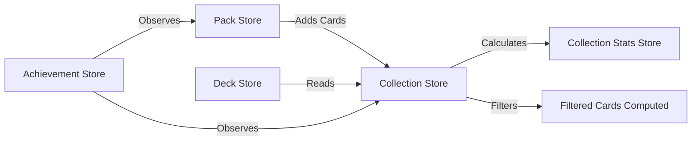

# Architecture Documentation - DadDeck™

This document outlines the technical architecture of DadDeck™, a satirical trading card game simulator built with Astro, Svelte, and Nanostores.

## 📖 Documentation Navigation
- 🏠 **[Project Home](./README.md)**
- 🤝 **[Contributing](./CONTRIBUTING.md)**
- 🔌 **[API Reference](./API_REFERENCE.md)**
- 🚢 **[Deployment](./DEPLOYMENT.md)**

---

## 🏗️ High-Level System Architecture

DadDeck™ follows a 4-layer architecture designed for high performance, SEO optimization, and reactive interactivity.

### The 4-Layer Model

### Component Hierarchy (Astro/Svelte Relationship)

---

## 🔄 Core Data Flows

### Pack Opening Sequence

---

## 🛠️ State Machine: PackState

The Pack Opener uses a robust state machine to handle the sequence. This ensures that visual effects and logic stay perfectly in sync.

---

## 🏬 Store Communication Diagram

How data flows through the Nanostore ecosystem:

---

## 🏝️ Island Strategy & Performance

To maintain a <3s load time and 60fps animations:
- **Partial Hydration:** Only interactive elements are Svelte components. Hero sections and footers remain static Astro HTML.
- **Code Splitting:** Dependencies are split into vendor chunks (e.g., `vendor-html2canvas`).
- **Image Pipeline:** High-resolution card art is optimized to WebP/AVIF during the build process via `scripts/optimize-images.mjs`.

## 🔒 Security Architecture

Although DadDeck™ is a client-side application, we implement "Defense in Depth":
- **Input Sanitization:** All user inputs (names, deck names) are sanitized.
- **State Integrity:** Stores use deep freezing or immutable updates to prevent accidental mutation.
- **Validation Hooks:** "Stop Hooks" in the state machine prevent advancing to the "Results" state if the pack generation doesn't pass statistical checks.

---

## 🛠️ State Machine: PackState

The Pack Opener uses a robust state machine to handle the 6-stage sequence:

| State | Description | Transition |
|-------|-------------|------------|
| `idle` | Waiting for user | `openPack()` -> `generating` |
| `generating` | Background generation & validation | Success -> `pack_animate` |
| `pack_animate` | Physical pack tear animation | Complete -> `cards_ready` |
| `cards_ready` | Individual cards are face-down | `revealCard()` -> `revealing` |
| `revealing` | Specific card reveal animation | All revealed -> `results` |
| `results` | Summary view with share options | `reset()` -> `idle` |

---

**Last Updated:** January 18, 2026
