# The Ralph Loop Architecture: A Comprehensive Analysis of Agentic Iteration and User Experience Paradigms

## 1. Executive Introduction: The Paradigm Shift from Chat to Action

The field of artificial intelligence is currently undergoing a structural transformation that
parallels the industrial revolution's shift from artisanal craftsmanship to mechanized assembly
lines. For the past decade, the dominant interface for AI has been the "Chatbot"—a linear,
conversational paradigm where a human prompts, the machine responds, and the interaction
waits for the next human input. This model, while revolutionary for information retrieval,
remains fundamentally constrained by its passivity. The AI waits; it does not pursue.

This report provides an exhaustive analysis of the successor to the Chatbot: the Autonomous
Agentic Loop, colloquially known in the engineering community as the "Ralph Loop." Named
after the character Ralph Wiggum from The Simpsons—a moniker chosen to embrace the
simplicity and persistence of the mechanism—this architecture represents a profound
divergence from previous AI interaction models.

The purpose of this document is twofold. First, it serves as a definitive "Idiot’s Guide" for User
Experience (UX) professionals, translating dense technical concepts like "Bash Loops,"
"Context Malicking," and "Git-based Memory" into accessible design principles. Second, it
rigorously corrects a pervasive category error in the industry: the confusion between the
"JavaScript Event Loop" (a browser mechanism) and the "Agentic Loop" (a cognitive
architecture).

Drawing from deep technical discussions involving Geoffrey Huntley, Dexter Horthy, and the
broader open-source community, this report deconstructs the mechanics of autonomous
iteration. It argues that for non-technical stakeholders, the transition from
Human-in-the-Loop (HITL) to Human-on-the-Loop (HOTL) is not merely a change in
workflow, but a fundamental reimaging of the human-computer contract.

## 2. Theoretical Foundations: Distinguishing the Loops

To design effective interfaces for autonomous agents, one must first dismantle the linguistic
confusion surrounding the word "Loop." In the domain of software engineering, "Loop" is a
loaded term. For a UX designer coming from a web background, it usually triggers
associations with browser performance. For an AI engineer, it refers to a recursive logic cycle.

### 2.1 The False Friend: The Browser Event Loop

It is critical to clarify what the Ralph Loop is not.

In web design and front-end development, the Event Loop is the engine that drives a web
browser like Google Chrome. It is responsible for:

- The Call Stack: Executing JavaScript code.
- Microtasks: Handling immediate promises.
- The Render Cycle: Repainting the screen (typically 60 times per second).
- Blocking: When a script takes too long, freezing the interface (Jank).

When a developer talks about "Event Loops" in a web context, they are discussing
responsiveness and frame rates. The provided video research confirms that terms like
"Microtasks" and "Render Cycle" are absent from the Ralph Loop discourse. This absence is
data in itself; it signals that the Ralph Loop operates at a different layer of abstraction—the
Application Logic Layer, not the Interface Presentation Layer.

### 2.2 The Agentic Reality: The "While" Loop

The Ralph Loop is conceptually simpler but functionally more complex than the browser loop.
It is a Logic Loop.

In computer science, a while loop is a control flow statement that allows code to be executed
repeatedly based on a given boolean condition.

The Ralph Loop applies this primitive to Artificial Intelligence:

"While the task is not finished, keep working."

This seems trivial, but in the context of Large Language Models (LLMs), it is revolutionary.
Traditional LLMs are stateless and finite; they generate tokens until they hit a stop sequence
and then cease to exist as a process. The Ralph Loop wraps this ephemeral intelligence in a
persistent structure, forcing it to look at its own output, evaluate it, and try again if it failed.

### 2.3 The "Bash Loop" Philosophy

Geoffrey Huntley, a primary proponent of this architecture, distills the concept to its absolute
essence: "Ralph is a Bash loop".

Bash is a command-line shell used in Unix-based systems. A "Bash loop" is a script that runs
commands in a circle.

By framing the most advanced AI technology (LLMs) inside the oldest, most rugged
technology (Bash scripts), engineers are making a statement about Reliability.

- The Problem: AI is stochastic (random/creative). It makes mistakes.
- The Solution: The Loop is deterministic (rigid/rules-based). It catches mistakes.
- The Result: A system that is "Antifragile." It improves through stress.

For the non-technical stakeholder, the analogy is the difference between a Consultant and
an Employee.

- ChatGPT (Consultant): You ask a question. It gives advice. It leaves. If the advice is
  wrong, it's your problem.
- Ralph Loop (Employee): You assign a task. It tries to do it. It checks if it worked. If not,
  it tries again. It does not leave until the job is done or you fire it.

## 3. The Cognitive Architecture of Autonomy

To design a dashboard for an autonomous agent, a UX designer must understand the agent's
"brain." This is not a biological brain, but a computational structure governed by strict limits.
The research introduces the concept of "Context Engineering" as the primary lever of
control.

### 3.1 Context Windows as Arrays

One of the most vivid metaphors retrieved from the video analysis is the description of
"Context Windows as Arrays".

An LLM does not "remember" the past; it "reads" the present. Its "memory" is simply the text
currently fed into it. This text buffer is the Context Window.

- The Array Metaphor: Imagine a long strip of film or a series of empty boxes (an array).
- Allocation (Malicking): "Malicking" is a term derived from the C programming function
  malloc (memory allocation). In the Ralph Loop, engineers don't just dump text into the
  window; they allocate specific sections of the array for specific purposes.

Visualizing the Array for UX:

If we were to visualize the agent's mind in a dashboard, it would look like a segmented bar
chart:

- Segment 1 (System Prompt): "You are a coding expert..." (Immutable).
- Segment 2 (The Plan): "Task 1: Build Login. Task 2: Build Database." (Pinned).
- Segment 3 (Active Context): The specific code file being edited (Dynamic).
- Segment 4 (Scratchpad): The agent's internal monologue and error logs (Transient).

This is a critical insight for design: Users need to see the allocation. If the agent is failing, it
is often because the "Active Context" segment is filled with junk (e.g., 5,000 lines of irrelevant
log files). A UX that visualizes "Context Health" allows the user to diagnose this.

### 3.2 The Smart Zone vs. The Dumb Zone

Perhaps the most actionable metric for Agentic UX is the distinction between the "Smart
Zone" and the "Dumb Zone".

LLM providers (like Anthropic or OpenAI) advertise massive context windows (e.g., 200,000
tokens). However, empirical research within the Ralph community suggests that reasoning
capability degrades non-linearly as the window fills.

Zone Utilization | Characteristics | UX Status
---|---|---
Smart Zone 0% – 40% | Peak Intelligence. The model can follow complex, multi-step instructions, recall obscure constraints, and spot subtle logic bugs. | 🟢 Optimal
Degradation Zone 40% – 60% | The "Lost in the Middle" phenomenon begins. The model starts to prioritize the beginning (Prompt) and end (Recent) of the context, ignoring the middle. | 🟡 Warning
Dumb Zone > 60% | Context Saturation. The model begins to "hallucinate" libraries that don't exist, forgets the original plan, and produces "lazy" code. | 🔴 Critical

The "Context Rot" Phenomenon:

Just as food rots if left out, context "rots" as the conversation drags on. The noise-to-signal
ratio increases.

The Ralph Loop solves this by aggressive resetting.

- The Mechanism: After every single task (e.g., "Fix the login button"), the Ralph Loop
  wipes the memory clean.
- The Benefit: The agent starts the next task ("Fix the logout button") with 0% context
  utilization. It is born fresh for every ticket.

Insight for Designers:

Traditional chat interfaces encourage long, scrolling histories. This is anti-pattern for agents. A
"Ralph" interface should celebrate the clearing of history. It should show the user: "Context
Reset. Agent is now entering the Smart Zone for Task #2." This builds trust by explaining why
the history disappeared—it was sacrificed for intelligence.

### 3.3 The Paradox of "Malicking"

The term "Malicking" implies a level of manual control that contradicts the "AI does
everything" marketing hype. It suggests that for an agent to be smart, a human (or a script)
must rigorously curate its inputs.

- Implication: We are moving away from "Prompt Engineering" (finding the magic words)
  to "Context Engineering" (managing the data pipeline).
- Design Opportunity: UX tools for "Context Management." Imagine a file tree where the
  user can toggle which files are "visible" to the agent, with a live counter showing how
  many tokens those files consume relative to the Smart Zone limit.

## 4. The "Lisa Plans, Ralph Does" Methodology

A recurring theme in the research is the separation of Planning and Execution. This is
codified in the ecosystem as the "Lisa/Ralph" split. This division of labor is essential for
non-technical stakeholders to understand, as it maps directly to human organizational
structures.

### 4.1 The Bicameral Agent

Attempting to make a single agent prompt do everything (Plan, Code, Test, Debug) leads to
immediate context saturation. The solution is to split the personality.

- Lisa (The Architect):
  - Role: Product Manager / Lead Architect.
  - Capabilities: High reasoning, low execution. Lisa asks questions. Lisa interviews
    the user.
  - Output: Lisa does not produce code. Lisa produces a Plan (specifically, a JSON
    file and a Markdown spec).
  - Motto: "Lisa Plans."
- Ralph (The Builder):
  - Role: Junior Developer / Contractor.
  - Capabilities: High endurance, task-specific focus. Ralph does not ask "Why?"
    Ralph asks "How?"
  - Input: Ralph consumes Lisa's Plan.
  - Output: Working Code.
  - Motto: "Ralph Does."

### 4.2 The Interactive Specification Interview

The "Lisa" phase introduces a novel UX pattern: The Machine-Led Interview.

Instead of the user staring at a blank prompt box (the "Blank Page Problem"), the interaction
is inverted.

1. User initiates: /lisa:plan "Build a crypto trading bot."
2. Lisa takes control: "Okay. Which exchanges should it support? Binance or Coinbase?"
3. User responds: "Binance."
4. Lisa drills down: "What is the risk tolerance? Stop-loss at 5% or 10%?"

UX Pattern: This is a Wizard Interface, but dynamic. The questions aren't hard-coded; they
are generated on the fly based on the user's previous answers.

- Visualizing Progress: The dashboard should show the "Spec" being built in real-time
  on the side of the chat. As the user answers questions, rows in the prd.json file are filled
  in.
- The "Stop Hook" for Humans: Lisa also has a loop. She keeps asking questions until
  she determines the spec is "Ready for Ralph." The user doesn't decide when to stop;
  the Architect does.

### 4.3 The Handoff Artifacts

The transition from Lisa to Ralph is mediated by files. This is a crucial concept: File-Based
State.

- prd.json: A machine-readable list of tasks.

JSON
{
  "tasks":
}

- spec.md: A human-readable narrative of the project.

Ralph's Workflow:

When Ralph starts, he reads prd.json. He finds the first todo item. He enters his loop to finish
just that item. When done, he updates the file to done.

UX Benefit: This file acts as a persistent Progress Bar. Even if the browser crashes, the server
restarts, or the power goes out, the prd.json remains. Ralph picks up exactly where he left off.

## 5. Technical Mechanics for Designers: The "Idiot's Guide" to the Engine Room

To explain why Ralph works to a non-technical designer, we must demystify the "Stop Hook"
and "Git Memory." These are the mechanical components that make the loop possible.

### 5.1 The Stop Hook: The "Bouncer"

In a standard ChatGPT session, the AI decides when to stop talking. It writes code, says "Here
you go!", and stops.

In a Ralph Loop, the AI is not allowed to stop until it proves it is done.

The Mechanism:

1. The Promise: The user (or Lisa) gives Ralph a "Completion Promise." Example: "The
   code must pass all tests in tests/auth.test.js."
2. The Attempt: Ralph writes code and tries to exit.
3. The Interception: A script (the Stop Hook) intercepts the exit attempt. It runs the tests.
4. The Rejection:
   - Scenario A (Pass): Tests pass. The Bouncer opens the door. Ralph exits.
   - Scenario B (Fail): Tests fail. The Bouncer slams the door. He hands Ralph the error
     logs and says, "Try again."

Visualizing the Stop Hook:

For a UX designer, this is the most dramatic moment of the interaction.

- Don't hide the failure. Show the Bouncer rejecting the work.
- The "Bounce" Animation: Use visual cues (e.g., a "shaking" screen or a red flash) to
  indicate: The Agent thought it was done, but the System said no.
- Why? This builds immense trust. The user sees that the system is rigorous. It proves
  that the AI isn't just hallucinating success.

### 5.2 Git as "Time Travel" Memory

Most "Chat with PDF" tools use Vector Databases (fuzzy search) for memory. Ralph uses Git
(exact history).

- The "Diff" Concept: When Ralph fails a test, he doesn't just look at the error. He looks
  at the git diff—the exact lines of code he just changed.
- Reasoning: "I changed line 45, and now the test fails. Therefore, line 45 is the problem."
  This is a level of deductive reasoning that Vector DBs cannot provide.

UX Pattern: The Timeline Scrubber

Since every attempt is a Git commit, the UX can offer a "Time Machine."

- Slider Interface: A horizontal slider representing the Loop Iterations (1 to 50).
- Interaction: The user can drag the slider back to see what Ralph was trying in Loop #12
  vs. Loop #45.
- "Revert to Here": If Ralph goes off the rails, the user can click a point on the timeline
  and say, "Reset to this reality."

### 5.3 The "Lethal Trifecta" and Sandboxing

The video research introduces a stark warning: the "Lethal Trifecta" of Shell Access, Network
Access, and File System Access.

An autonomous agent with these three powers is effectively a human user sitting at your
keyboard. If it hallucinates a command like rm -rf / (delete everything), it happens.

UX Requirement: Visceral Safety Indicators

- The Sandbox: Ralph must run in a container (a virtual box). The UX should visually
  represent this isolation.
  - Design Idea: Display the agent inside a literal visual box or frame that is distinct
    from the user's local files.
- The "Blast Radius": The video discusses limiting the "blast radius". The UI should
  clearly show which files are writable and which are read-only.
- "God Mode" Switch: The research mentions a flag: --dangerously-skip-permissions.
  In a GUI, this should be a "Break Glass in Case of Emergency" toggle—red, protected by
  a confirmation dialog, pulsing with warning.

## 6. UX Design Patterns for Autonomy: From HITL to HOTL

The transition to Ralph Loops necessitates a shift from Human-in-the-Loop (HITL) to
Human-on-the-Loop (HOTL). This is the core psychological shift for the user.

### 6.1 Understanding the Agency Gradient

Level | Paradigm | User Action | Agent Action | UX Pattern
---|---|---|---|---
Level 1 | Copilot (HITL) | Initiates every step. Reviews every line. | Suggests completions. | Text Editor / Autocomplete
Level 2 | Chatbot (HITL) | Prompts. Reads response. Reprompts. | Generates blocks of text. | Chat Bubble Stream
Level 3 | Ralph Loop (HOTL) | Sets Goal. Watches telemetry. Intervenes only on stalls. | Plans, executes, tests, iterates. | Mission Control Dashboard

### 6.2 The Mission Control Dashboard

The non-technical user cannot debug a streaming bash log. They need a dashboard that
abstracts the loop into Telemetry.

Proposed Visual Hierarchy:

1. Top Bar (The Objective): Large text displaying the "Completion Promise." (e.g.,
   "Objective: Fix Mobile Layout").
2. Center Stage (The Loop): A cyclical animation showing the current phase:
   - Phase 1: Planning (Thinking...)
   - Phase 2: Coding (Typing...)
   - Phase 3: Verifying (Testing...)
   - Phase 4: Reflecting (Reading Errors...)
3. Side Panel (The "Brain"): The Context Array visualization (Smart/Dumb Zone meter).
4. Bottom Rail (The History): The Git Timeline slider.

### 6.3 Visualizing Backpressure

"Backpressure" is the force that keeps the agent honest (tests, linters, compilers).

- The "Traffic Light" Pattern:
  - The agent submits code.
  - A row of lights appears:
    - Build: 🟢 (Pass)
    - Lint: 🟢 (Pass)
    - Test: 🔴 (Fail)
  - The loop pauses briefly at the Red light, then loops back.
- Why it works: It gamifies the debugging process. The user finds themselves rooting for
  the lights to turn green. It transforms "waiting for code" into "watching a sport."

### 6.4 Steerability: The "Nudge"

The video research describes "poking" the model. In a HOTL workflow, the user is a
supervisor. If the supervisor sees the worker struggling, they don't fire them; they offer a hint.

The "Nudge" Interaction:

- Scenario: The dashboard shows Ralph has failed the "Test" phase 5 times in a row with
  the same error.
- User Action: The user types into a "Nudge" box: "You are missing an import in the
  header."
- System Action: This text is injected into the System Prompt of the next loop iteration.
- Result: Ralph wakes up in the next loop with a new voice in his head: "Check the
  imports." He fixes it.
- UX Significance: This maintains user agency without requiring the user to take over the
  keyboard. It is "Guidance," not "Correction."

### 6.5 The Cost of Autonomy

Autonomous loops burn tokens. A loop that runs 50 times costs 50x more than a single
prompt.

- Economic Transparency: The dashboard must show "Run Cost" in real-time.
- The "Wallet" Meter: A visual indicator of the budget.
  - "Estimated cost to complete: $0.45"
  - "Max Budget: $2.00"
- The Kill Switch: If the cost approaches the budget, the system should auto-pause. This
  alleviates the anxiety of "runaway loops" draining a credit card.

## 7. Visualizing the Flows: Mermaid.js Schematics

To assist the UX designer in creating these dashboards, we provide precise Mermaid.js flow
diagrams representing the logic.

### 7.1 The "Lisa Plans, Ralph Does" Workflow

This diagram illustrates the separation of concerns and the artifacts passed between the two
agents.

```mermaid
graph TD
  subgraph "Phase 1: Lisa (The Architect)"
    User[User] -->|Invokes /lisa:plan| Lisa[Lisa Agent]
    Lisa -->|Asks Questions| User
    User -->|Provides Answers| Lisa
    Lisa -->|Synthesizes| Spec
    Lisa -->|Generates| PRD
  end

  subgraph "Phase 2: Ralph (The Builder)"
    PRD -->|Reads Todo Item| Ralph
    Ralph -->|Starts Loop| Loop{Ralph Loop}
    Loop -->|1. Malick Context| Context[Context Array]
    Context -->|2. Generate Code| Code[Codebase]
    Code -->|3. Run Stop Hook| Hook{Stop Hook / Tests}
    Hook -->|Fail (Exit Code 2)| Error[Error Logs]
    Error -->|Inject into Context| Context
    Hook -->|Success (Exit Code 0)| Commit[Git Commit]
    Commit -->|Update Status| PRD
  end

  style Lisa fill:#f9f,stroke:#333,stroke-width:2px
  style Ralph fill:#ccf,stroke:#333,stroke-width:2px
  style Hook fill:#f96,stroke:#333,stroke-width:2px
```

### 7.2 The Context Array & Smart Zone

This diagram visualizes the internal state of the agent's memory during the loop.

```mermaid
gantt
  title Context Window Allocation (The "Malicking" Process)
  dateFormat X
  axisFormat %s

  section The Smart Zone (0-40%)
  System Prompt :active, a1, 0, 10
  Pinned Plan (PRD) :active, a2, 10, 20
  Active Code File :active, a3, 20, 35

  section The Degradation Zone (40-60%)
  Git Diff (History) :done, a4, 35, 55

  section The Dumb Zone (>60%)
  Hallucination Risk :crit, a5, 55, 100
```



## 8. Second and Third-Order Implications

### 8.1 The Economic Obsolescence of "Junior" Tasks

The Ralph Loop fundamentally changes the unit economics of software engineering.

- Old Model: Junior developers write code, seniors review it.
- Ralph Model: Ralph writes code (at 1/100th the cost), seniors review the specs.

Insight: The value of a human engineer shifts from "syntax generation" to "specification
verification." UX tools must reflect this. The "Editor" of the future is not a code editor
(VS Code); it is a Requirement Editor (Jira on steroids).

### 8.2 Plan Disposability

The concept of "Plan Disposability" suggests that because plans are cheap to generate (Lisa
can write a new one in 10 seconds), we should never "update" a plan—we should just trash it
and regenerate it.

- UX Implication: Don't build complex "Edit Plan" interfaces. Build "Regenerate Plan"
  buttons. If the environment changes, blow away the old roadmap and ask Lisa for a new
  one. This is Dynamic Planning.

### 8.3 The Rise of the "Context Engineer"

A new persona is emerging: the Context Engineer. This is the person who tweaks the loop.sh
script, adjusts the "Malicking" ratios, and sets the "Smart Zone" thresholds.

- UX Implication: "Settings" pages for AI tools will become incredibly complex. They will
  look like overclocking dashboards for CPUs, allowing users to tune "Temperature,"
  "Context Limits," and "Loop Retries."

## 9. Conclusion

The Ralph Loop is not a feature; it is an architecture. It represents the maturation of
Generative AI from a creative toy into a productive engine. By binding the chaotic capability of
LLMs with the rigid discipline of a while loop, engineers have created a synthetic worker that
persists until it succeeds.

For the User Experience Designer, the challenge is immense but exciting. You are no longer
designing for a user talking to a machine. You are designing for a Human Supervisor
managing a Synthetic Workforce. The metrics that matter are no longer "Response Time" or
"Chat Bubble Color." They are "Context Health," "Loop Velocity," "Backpressure
Visualization," and "Agency."

The "Idiot's Guide" takeaway is simple: Don't trust the AI to know when it's done. Trust the
Loop to prove it.

## Appendix: Glossary of Terms for UX Designers

- Ralph Loop: An autonomous cycle where the AI tries, fails, learns, and retries until a
  specific test passes.
- Stop Hook: The "Bouncer" script that runs tests and prevents the AI from saying "I'm
  done" if the code is broken.
- Context Window: The AI's short-term memory capacity (e.g., 200k words).
- Smart Zone: The first ~40% of the Context Window where the AI is most intelligent.
- Dumb Zone: The danger zone (>60%) where the AI becomes forgetful and hallucinates.
- Malicking: The deliberate engineering of what data goes into the Context Window
  (System Prompt vs. User Data).
- Lisa: The "Planning Agent" persona that interviews the user to create specs.
- Ralph: The "Doing Agent" persona that executes the specs.
- Human-on-the-Loop (HOTL): A workflow where the human watches a dashboard and
  supervises, rather than manually approving every step.
- Backpressure: Automated signals (errors, failed tests) that push the AI to correct itself.

## Works cited

1. Ralph Wiggum and AI Coding Loops: From Springfield to Real ..., accessed
   January 17, 2026,
   https://securityboulevard.com/2026/01/ralph-wiggum-and-ai-coding-loops-from-springfield-to-real-world-software-automation/
2. The Ralf Wiggum Breakdown - DEV Community, accessed January 17, 2026,
   https://dev.to/ibrahimpima/the-ralf-wiggum-breakdown-3mko
3. Ralph Wiggum (and why Claude Code's implementation isn't it) with Geoffrey
   Huntley and Dexter Horthy, accessed January 17, 2026,
   https://www.youtube.com/watch?v=O2bBWDoxO4s
4. Inventing the Ralph Wiggum Loop | Dev Interrupted Powered by LinearB,
   accessed January 17, 2026,
   https://linearb.io/dev-interrupted/podcast/inventing-the-ralph-wiggum-loop
5. The Ralph Wiggum Playbook - Emergent Minds | paddo.dev, accessed January 17,
   2026, https://paddo.dev/blog/ralph-wiggum-playbook/
6. The Context Advantage - Anup Jadhav, accessed January 17, 2026,
   https://www.anup.io/the-context-advantage/
7. blencorp/lisa: Lisa plans. Ralph does. Interactive ... - GitHub, accessed January 17,
   2026, https://github.com/blencorp/lisa
8. Ralph is an autonomous AI agent loop that runs repeatedly until all PRD items are
   complete. - GitHub, accessed January 17, 2026,
   https://github.com/snarktank/ralph
9. Human in the Loop Meaning: Why HITL Matters in AI and Machine Learning -
   AnyforSoft, accessed January 17, 2026,
   https://anyforsoft.com/blog/human-in-the-loop-meaning-why-hitl-matters-in-ai-and-machine-learning/
10. Human-on-the-Loop: The New AI Control Model That Actually Works, accessed
    January 17, 2026,
    https://thenewstack.io/human-on-the-loop-the-new-ai-control-model-that-actually-works/
11. Confirmed: Claude Code CLI burns ~1-3% of your quota immediately on startup
    (even with NO prompts) - Reddit, accessed January 17, 2026,
    https://www.reddit.com/r/ClaudeCode/comments/1qazqq6/confirmed_claude_code_cli_burns_1_3_of_your_quota/
12. The Context Window Paradox: Engineering Trade-offs in Modern LLM
    Architecture | by Shashwata Bhattacharjee | Nov, 2025 | Towards AI, accessed
    January 17, 2026,
    https://pub.towardsai.net/the-context-window-paradox-engineering-trade-offs-in-modern-llm-architecture-d22d8f954a05
