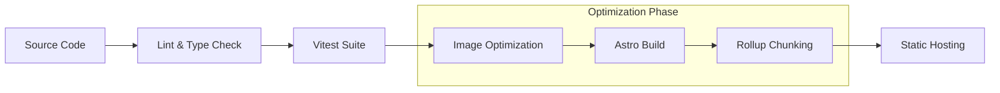

# Deployment Guide - DadDeck™

DadDeck™ is optimized for high-performance deployment on modern static hosting platforms like Vercel, Netlify, or Cloudflare Pages.

## 📖 Documentation Navigation
- 🏠 **[Project Home](./README.md)**
- 🏗️ **[Architecture](./ARCHITECTURE.md)**
- 🔌 **[API Reference](./API_REFERENCE.md)**
- 🤝 **[Contributing](./CONTRIBUTING.md)**

---

## 🏗️ Build Pipeline

Our build process ensures that the site is optimized for speed and that all interactive "islands" are correctly prepared.

## 📦 Prerequisites for Production

Before deploying, ensure you have run the following local checks:

1. **Test Suite:** `bun run test:run` (Ensure 100% pass rate)
2. **Build Test:** `bun run build` (Ensure no compilation errors)
3. **Image Optimization:** `bun run optimize:images` (Reduces asset weight by ~60%)

## 🚀 Deployment Platforms

### Vercel (Recommended)
The project is configured for Vercel out of the box.

1. **Connect Repository:** Link your GitHub/GitLab/Bitbucket repo.
2. **Framework Preset:** Select **Astro**.
3. **Build Settings:**
   - Build Command: `bun run build`
   - Output Directory: `dist`
   - Install Command: `bun install`
4. **Environment Variables:** (Optional, see below)

### Netlify
1. **Connect Repository:** Link your repo.
2. **Build Settings:**
   - Build Command: `bun run build`
   - Publish Directory: `dist`
3. **Netlify.toml:** The project includes or can accept a `netlify.toml` for custom headers.

## 🔧 Environment Variables

DadDeck™ uses `import.meta.env.PUBLIC_*` for client-side configuration.

| Variable | Description | Default |
|----------|-------------|---------|
| `PUBLIC_GA_ID` | Google Analytics Tracking ID | `undefined` |
| `PUBLIC_PLAUSIBLE_DOMAIN` | Plausible Analytics Domain | `undefined` |
| `PUBLIC_API_URL` | Future backend API endpoint | `http://localhost:4321` |
| `DISCORD_BOT_TOKEN` | Token for Discord Bot (Server-only) | `undefined` |

## 🛠️ Build Optimization

Our `astro.config.mjs` includes several production-ready optimizations:

- **Terser Minification:** Removes all `console.log` statements in production.
- **Manual Chunking:** Splits heavy libraries into separate chunks for better caching.
  - `vendor-html2canvas`: ~150KB
  - `vendor-svelte`: ~60KB
- **CSS Inlining:** Inlines critical CSS to improve First Contentful Paint (FCP).
- **Image Service:** Uses Astro's built-in image service with Sharp for optimized asset delivery.

## 📊 Post-Deployment Verification

After deployment, check the following:

1. **Lighthouse Score:** Aim for 90+ in Performance and SEO.
2. **Sitemap:** Verify `yourdomain.com/sitemap-index.xml` exists.
3. **PWA Status:** Check if the manifest and service worker load correctly for offline support.
4. **Social Cards:** Use [metatags.io](https://metatags.io/) to verify Open Graph image and descriptions.

---

## 🏗️ Architecture Connections

Deployment decisions are driven by our **[Architecture](./ARCHITECTURE.md)**:
- **Island Hydration:** Build settings ensure Svelte islands only load when needed.
- **Static First:** Astro's static generation maximizes global CDN performance.
- **State Persistence:** LocalStorage-based state means zero backend latency for user data.

---

## 🔗 See Also

- **[Architecture Deep Dive](./ARCHITECTURE.md)** - Learn about Layer 1 (UI) and Layer 4 (Data).
- **[Performance Optimization](./docs/PERFORMANCE_OPTIMIZATION.md)** - Specific technical targets for production.
- **[Astro Docs](https://docs.astro.build)** - Official framework documentation.

---

## ⚠️ Known Deployment Issues

- **Memory Limits:** Large image optimization tasks may fail on free tier CI/CD (e.g., GitHub Actions). If the build fails during `optimize:images`, run it locally and commit the optimized assets in `public/`.
- **LocalStorage Quota:** Remind users that data is local. For production, consider implementing a "Cloud Sync" feature using a database.

---

**Last Updated:** January 18, 2026
